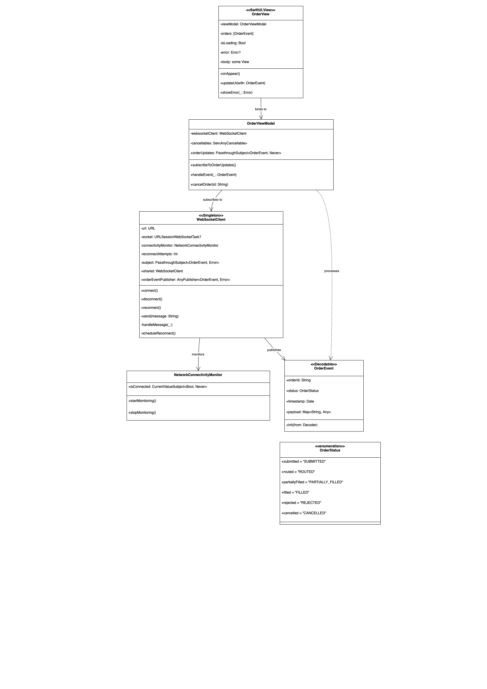

# WebSocket Client Documentation

## Overview
This documentation covers the complete WebSocket client implementation for handling real-time events in a Swift application, including the core `WebSocketService` implementation.

## Table of Contents
1. [Core Components](#core-components)
2. [Models](#models)
3. [WebSocket Services](#websocket-services)
4. [Error Handling](#error-handling)
5. [Environment Configuration](#environment-configuration)
6. [Mock Services](#mock-services)
7. [Usage Examples](#usage-examples)

---

## Core Components

### WebSocketService
```swift
final class WebSocketService: WebSocketClient
```
The main WebSocket implementation that handles:
- Connection lifecycle management
- Authentication
- Message sending/receiving
- Error handling

**Key Features:**
- Thread-safe connection state management
- Automatic reconnection capability
- Type-safe message encoding/decoding
- Clean resource disposal

**Initialization:**
```swift
init(
    session: URLSession = .shared,
    decoder: JSONDecoder = .default,
    encoder: JSONEncoder = .default,
    environment: Environment = .defaultEnvironment
)
```

**Lifecycle Methods:**
| Method | Description |
|--------|-------------|
| `authenticate(token:)` | Establishes connection and authenticates |
| `send(_:)` | Sends encodable messages |
| `receive(as:)` | Streams decoded messages |
| `disconnect()` | Cleanly closes connection |

---

## Models

### AuthPayload
```swift
struct AuthPayload: Encodable
```
- Authentication structure with:
  - Required `token` string
  - Hardcoded `action: "authenticate"`

### WebSocketMessage
```swift
struct WebSocketMessage<T: Codable>: Codable
```
- Generic message wrapper with:
  - `type`: Message identifier
  - `payload`: Generic content
  - `meta`: Optional timestamp metadata

### EventDTO
```swift
struct EventDTO: Decodable
```
- Event data model containing:
  - `id`, `title`, `location`
  - `startTime`/`endTime` dates
  - `eventStatus` enum

### EventStatus
```swift
enum EventStatus: String, Decodable
```
- Status cases with display extensions:
  - `.submitted`, `.routed`, etc.
  - `title`: User-friendly strings
  - `color`: Status-specific colors

---

## WebSocket Services

### Protocol
```swift
protocol WebSocketClient
```
Standard interface for:
- Authentication
- Message sending/receiving
- Connection management

### Implementation
```swift
final class WebSocketService: WebSocketClient
```
**Key Implementation Details:**
- Uses `URLSessionWebSocketTask` internally
- Manages connection state automatically
- Provides type-safe message handling
- Includes proper resource cleanup

### Mock Service
```swift
final class MockWebSocketClient: WebSocketClient
```
- Testing/preview implementation
- Configurable mock responses
- Simulated network delays

---

## Error Handling

### WebSocketError
```swift
enum WebSocketError: Error
```
Comprehensive error cases:
- Connection failures
- Message processing errors
- Server communication issues
- Encoding/decoding failures

---

## Environment Configuration

### Environment
```swift
enum Environment
```
- Manages deployment environments (dev/qa/prod)
- Provides environment-specific WebSocket URLs
- Automatic environment selection:
  - Debug → dev
  - Testing → qa
  - Release → prod

### JSON Coding
```swift
extension JSONDecoder/Encoder
```
Preconfigured with:
- ISO8601 date handling
- Snake case conversion
- Standardized configuration

---

## Usage Examples

### Basic Setup
```swift
let service = WebSocketService()
```

### Authentication
```swift
try await service.authenticate(token: "user_token")
```

### Sending Messages
```swift
let request = EventRequest(action: "subscribe", eventId: "123")
try await service.send(request)
```

### Receiving Updates
```swift
let stream = service.receive(as: WebSocketMessage<EventDTO>.self)
for try await message in stream {
    handleEvent(message.payload)
}
```

### Clean Disconnection
```swift
service.disconnect()
```

### Mock Usage
```swift
let mock = MockWebSocketClient(mockUpdates: [testEvent])
```

---

## Architecture Diagram


---

## Best Practices

1. **Connection Management**
   - Always call `disconnect()` when done
   - Check `isConnected` before operations
   - Handle authentication errors gracefully

2. **Message Handling**
   - Use strong types for messages
   - Implement proper error handling
   - Consider message validation

3. **Testing**
   - Use mock service for unit tests
   - Test different network conditions
   - Verify error recovery

4. **Performance**
   - Reuse WebSocketService instances
   - Minimize message size
   - Consider compression for large payloads

---

## Dependencies
- Foundation
- SwiftUI (for status display extensions)
- Combine (for reactive streams)

---

## Troubleshooting Guide

| Symptom | Possible Cause | Solution |
|---------|---------------|----------|
| Connection fails | Invalid URL/Network issues | Verify environment URL |
| Authentication fails | Invalid token | Check auth token |
| Message decoding fails | Type mismatch | Verify payload structure |
| Unexpected disconnects | Network instability | Implement reconnection logic |
## Diagram
# Class diagram

