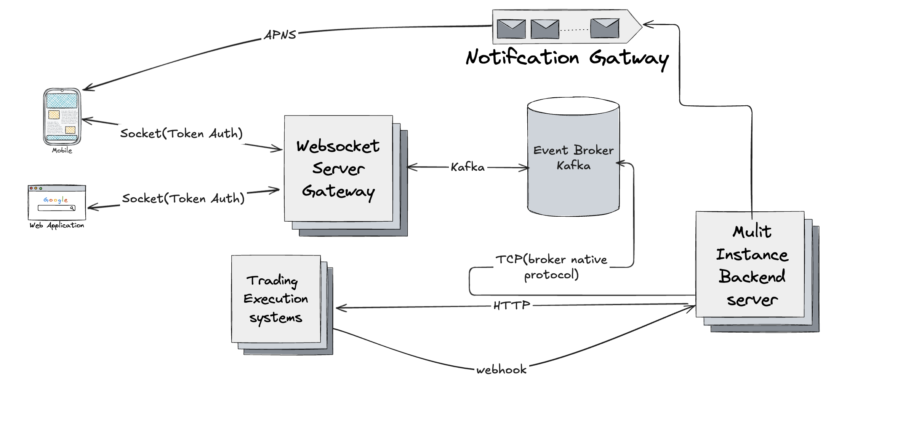

# Real-Time Order Status & Trade Notifications

## 1. Problem Analysis

### Business Requirement Scope

To begin, it's important to unpack the initial request: "We want users to instantly see updates on their open orders and executions without refreshing manually." This speaks to a need for real-time communication between backend systems and frontend clients across both mobile and web platforms. However, the requirement is open-ended in a few areas.

#### Key Assumptions

* A trading backend and order management system already exists and emits order events.
* Integration with Trading Execution Systems(Third Parties) throw webhook.
* Frontend for reciving and handling order status at real time.
* Security and performance are critical given the financial domain.
* Users may be logged in from multiple devices simultaneously.

#### Open Questions

* What types of trading assets are supported (e.g., stocks, ETFs, crypto)?
* Are order status updates standardized across asset types?
* What authentication and authorization mechanisms are already in place?
* What is the acceptable latency threshold for updates?

### What Makes the Requirement Vague?

* It lacks specific performance benchmarks (e.g., maximum update delay and standard response time).
* No information is provided about multi-device scenarios or user session management.
* There is no mention of degraded mode, fallback behavior, or offline handling.
* UX expectations for how updates should appear on mobile and web are not defined.
* UI expectations for how updates manually pull to refesh in order details.

### MVP vs Full Solution

#### Minimum Viable Product (MVP):

* Support for mobile background notifications (e.g., FCM).
* Deliver instant updates to connected clients upon order state changes via FCM or APNS.
* Implement basic UI hooks to reflect changes (submitted, filled, canceled, etc.).

#### Full-Scale Implementation:

* Establish a real-time communication channel (e.g., WebSocket).
* Retry and reconnection logic for resilience.
* Monitoring, alerting, and logging infrastructure.
* Fallback polling mechanism for clients without WebSocket support.
* Multi-region readiness for global user base.

### User Journeys and Edge Cases

* A user places an order and sees an immediate "Submitted" update.
* The order transitions through "Partially Filled" to "Filled" with live updates.
* A user receives updates on both their mobile and web application.
* The user’s network disconnects; the app reconnects and fetches the latest state.
* Users trading different asset types receive consistent update experiences.
* When the app is offline, the user should see a 'No Internet' message, the latest update date, and the most recently updated data.
---

## 2. System Design Document

### Overview

To meet the business goals, we’ll architect a loosely coupled, event-driven system using WebSockets for active sessions and push notifications for passive ones. The backend emits events, which are relayed to users through a notification gateway.

### Architecture Components

1. **Client Applications**: Web (React - Redux), Mobile (Kotlin/Swift)
2. **Notification Gateway**: WebSocket server responsible for pushing messages to connected clients
3. **Backend Trading System**: Emits order lifecycle events
4. **Message Broker**: Kafka or Redis Pub/Sub to decouple backend and gateway
5. **Fallback Polling Service**: REST endpoint for clients that can’t maintain a WebSocket
6. **Load Balancer**: Used to manage and distribute incoming traffic across multiple servers to ensure reliability and performance.
7. **Rate Limiter**: Helps prevent abuse by blocking duplicate or excessive requests, ensuring fair usage and protecting backend resources.
### Architecture Diagram

### Sequence Diagram

### Real-Time Update Mechanism

* **Primary Channel**: WebSocket for low-latency, bi-directional communication
* **Background Notifications**: Firebase Cloud Messaging (FCM) or APNS for mobile devices in sleep mode
* **Event Flow**:

  1. Backend receives status updates from third-party trading execution systems via webhooks.
  2. Backend publishes order status changes to a messaging system like Kafka or Redis Pub/Sub
  3. Clients subscribe to the relevant topics or channels to listen for updates.
  4. When a new update is received, the client reactively updates the UI to reflect the latest order status.

### Platform-Specific Data Flow

* **Web**: Connects to WebSocket endpoint on page load; listens for state updates.
* **Mobile**:

  * Foreground: WebSocket connection for real-time updates.
  * Background: FCM or APNS notifications trigger local update fetches when websocket dissconnect.

### Error Handling & Degraded Mode

* Automatically attempt to reconnect the WebSocket if the connection is lost.
* If reconnection keeps failing, gracefully fall back to periodic polling using the API.
* If there's no internet connection, show cached data along with the timestamp of the last successful update.

### Caching Mechaniesm

* When the user goes offline, the app automatically falls back to cached data to keep the experience smooth and uninterrupted.
* The UI shows the most recent available data along with the time it was last updated, so users know how fresh the information is.
* If real-time updates via WebSocket, the system relies on this cache or switches to API polling to ensure users still see relevant information.

### Tech Stack Choices

* **Gateway**: Node.js or Go for high concurrency
* **Messaging**: Kafka (durability) or Redis (simplicity)
* **Mobile/Web**: Swift, Kotlin
* **Monitoring**: Prometheus + Grafana for system metrics, Sentry for client-side errors

---

## 3. Mentorship Plan
[View mentorship plan Documentation](./mentorshipPlan.md)

---

## 4. Bonus: Operational Enhancements

### Monitoring and Observability

* Track WebSocket connection count, reconnection attempts, message latency
* Use dashboards for latency spikes and failure alerts

### Fallback Strategy

* Polling endpoint exposed by Gateway
* Client auto-falls back after N retries or if server signals degradation
* Synchronize last known state and resume updates upon reconnect

### Multi-Region Scalability

* Deploy WebSocket servers across regions (e.g., via AWS Global Accelerator)
* Use Geo-aware DNS to route clients to the nearest gateway
* Use Kafka replication or global pub/sub (e.g., GCP Pub/Sub) for data consistency

### API Documnetation
[View API documentation](./APIDocumentation.md)

### Code Documnetation
[View code documentation](./Code.md)
